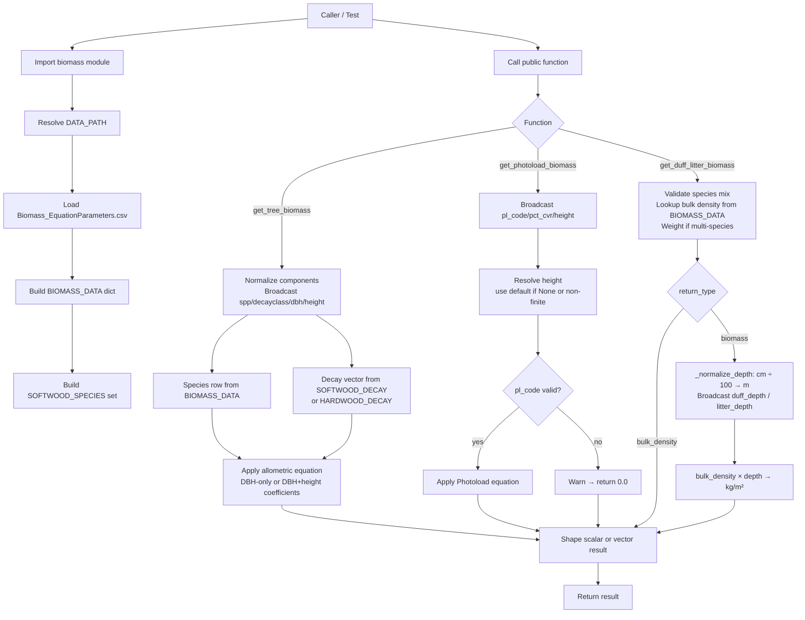

# Codebase Reference

## Architecture Overview

This repository is a small Python library for biomass calculations.

The codebase is centered on a runtime package, `src/biomass/`, with the main implementation in `src/biomass/core.py`, which:

- loads species and coefficient data from a CSV file at import time
- stores that data in module-level in-memory structures
- exposes three public calculation functions
- supports both scalar inputs and vector/array-like inputs

The project does not currently include:

- an API server
- a CLI application
- background jobs
- persistence beyond the bundled CSV data file

The runtime shape is therefore:

1. Python imports `biomass`
2. `src/biomass/__init__.py` triggers import of `src/biomass/core.py`
3. `core.py` loads `src/biomass/supplementary_data/Biomass_EquationParameters.csv`
4. module-level lookup structures are created in `core.py`
5. `__init__.py` re-exports the public names via `__all__`
6. callers invoke one of the public calculation functions
7. inputs are validated, normalized, calculated, and returned

## Key Files

### Runtime

- `src/biomass/__init__.py`
  - Package entry point
  - Re-exports the public API from `src/biomass/core.py`

- `src/biomass/core.py`
  - Main implementation module
  - Defines constants, lookup tables, private helpers, and the full public API
  - Loads the CSV dataset relative to its own file location

- `src/biomass/supplementary_data/Biomass_EquationParameters.csv`
  - Canonical input dataset for species metadata and biomass coefficients
  - Used for tree biomass coefficients and duff/litter bulk density values

- `pyproject.toml`
  - Build metadata for PyPI packaging
  - Declares the project package, package data, and build backend

- `conda-recipe/meta.yaml`
  - Starter Conda recipe for building the same package

### Tests

- `tests/test_biomass.py`
  - `unittest` suite for the public API
  - Adds `src/` to `sys.path` and imports `biomass` directly
  - Covers scalar and vector behavior for:
    - `get_tree_biomass`
    - `get_photoload_biomass`
    - `get_duff_litter_biomass`

## Public API

The current public surface is exposed through `src/biomass/__init__.py` and implemented in `src/biomass/core.py`:

- `get_duff_litter_biomass(...)`
  - Returns duff/litter bulk density or biomass
  - Supports single-species and weighted species-mix calculations

- `get_photoload_biomass(...)`
  - Returns biomass estimates for Photoload-coded plants
  - Supports scalar and vector inputs

- `get_tree_biomass(...)`
  - Returns biomass estimates for tree components
  - Supports scalar and vector inputs

## Internal Structure

The internal code organization in `src/biomass/core.py` follows this pattern:

1. module constants and lookup dictionaries
2. private helpers
3. module-level data loading
4. public API functions

Notable helper roles:

- `_load_biomass_data`
  - Reads the CSV and converts numeric fields to floats

- `_any_array`
  - Returns True if any argument is a np.ndarray; drives scalar-vs-array return mode

- `_to_1d_array`
  - Coerces a scalar or array to a 1-D ndarray for uniform internal processing

- `_normalize_components`, `_normalize_depth`, `_validate_species_mix`
  - Input validation and normalization helpers

- `_get_species_row`, `_get_bulk_density`
  - Lookup and derived-value helpers

- `_calculate_photoload_biomass`
  - Photoload equation, accepts scalar or array slices for pct_cvr and height

## Data Flow

## Implicit Assumptions and Gotchas

These are structural assumptions the current code relies on.

### Import-time data loading

`src/biomass/core.py` loads its CSV immediately when imported. Any caller importing the package assumes:

- the CSV exists
- the relative path from the package module is correct
- the CSV schema matches what `_load_biomass_data` expects

This means import is not just declaration time; it performs file I/O and data parsing.

### CSV schema is part of the API contract

The implementation assumes the CSV contains:

- `Species`
- `TreeType`
- duff/litter fields such as `DUFF_BD` and `LITTER_BD`
- multiple biomass coefficient columns with exact names

Column naming is tightly coupled to the code, especially for tree component equation lookup.

### `src/` layout is handled by test path injection

The current tests do not import via an installed package. Instead, `tests/test_biomass.py` prepends `src/` to `sys.path` and imports `biomass` directly.

That means the current repo layout assumes either:

- callers manipulate `PYTHONPATH` / `sys.path`, or
- the project is executed from an environment that already knows about `src/`

### Vector support is NumPy-based

Vectorized behavior is implemented through `np.ndarray` inputs and NumPy math operations.
Passing any `np.ndarray` argument to a public function triggers array mode: inputs are
broadcast to a common length, calculations run on masked slices per unique species or code,
and the return value is an `np.ndarray` (or tuple of ndarrays for multi-component results).

Plain Python lists are **not** a supported vector input type. Pass scalars or `np.ndarray`.
`numpy>=1.24` is a required runtime dependency.

### Return shape depends on input shape

The public functions return different shapes based on the inputs:

- scalar inputs return scalar-like values (`float` or `tuple[float, ...]`)
- `np.ndarray` inputs return `np.ndarray` or `tuple[np.ndarray, ...]`
- for `get_tree_biomass` with multiple components, the return is always a tuple (of floats or ndarrays)
- for `get_duff_litter_biomass`, the return type also depends on whether one or both depths are supplied

Plain Python lists are not supported as vector inputs — pass `np.array(...)` instead.

### Warning-based behavior for invalid Photoload species

Photoload invalid-species handling differs from most other validation paths:

- tree and duff/litter validation primarily raise exceptions
- Photoload invalid species emits a warning and returns `0.0`

That is an intentional behavioral distinction in the current code.

### Hardwood decay class range is smaller than softwood

`SOFTWOOD_DECAY` defines classes 1–9. `HARDWOOD_DECAY` defines classes 1–6 only.
Passing `decayclass=7`, `8`, or `9` for a hardwood species raises `ValueError` via the inline decay-class validation in `get_tree_biomass`.

### `pct_list` sum is checked with a tolerance

`_validate_species_mix` accepts a species percentage list whose values sum within ±0.5 of 100
(`math.isclose(sum(pct_list), 100.0, abs_tol=0.5)`). Values that sum to 99.6 or 100.4 pass;
values outside that range raise `ValueError`.

### Depth inputs are in cm; biomass output is in kg/m²

`_normalize_depth` divides each depth value by 100 to convert cm to metres before multiplying by
bulk density. Bulk density values in the CSV are in kg/m³, so the resulting biomass is in kg/m².
Callers must supply depths in centimetres or the result will be off by a factor of 100.

### `get_duff_litter_biomass` return shape when only one depth is given

When only `duff_depth` or only `litter_depth` is provided (not both), each result element is a
plain `float`, not a `(duff, litter)` tuple. When both depths are provided, each element is a
two-element tuple. The return shape therefore depends on which depth arguments are supplied.

### `components` is a fixed set applied to every tree in a vectorized call

In `get_tree_biomass`, `components` is normalized once and applied to all tree records in the batch.
You cannot specify different components for different trees in a single vectorized call.
`components` applies uniformly to every tree in the batch and is not broadcast per element.

### Module-level constants are formally part of the public API

The following names are explicitly listed in `__init__.__all__` and re-exported from `core.py`:

- `BIOMASS_DATA`
- `SOFTWOOD_DECAY`
- `HARDWOOD_DECAY`
- `SOFTWOOD_SPECIES`
- `TREE_COMPONENT_INDEX`
- `TREE_COMPONENTS`
- `PHOTOLOAD_DEFAULT_HEIGHTS`

All are accessible as `biomass.<name>` and should be treated as stable public exports alongside the
three calculation functions.

### Domain constants live in code

Several domain rules are hard-coded in `src/biomass/core.py`, including:

- tree component names
- softwood and hardwood decay tables
- default Photoload heights

These are treated as code-level constants, not external configuration.

## Testing Conventions

The current test suite uses the standard library `unittest` framework and groups tests by public function:

- `GetTreeBiomassTests`
- `GetPhotoloadBiomassTests`
- `GetDuffLitterBiomassTests`

Tests are written as API-level behavioral checks rather than low-level helper tests.

## Current Mental Model

The simplest way to think about this repo:

- one module
- one CSV dataset
- three public calculation functions
- a small helper layer for validation, broadcasting, and lookup
- one test module validating the public interface
