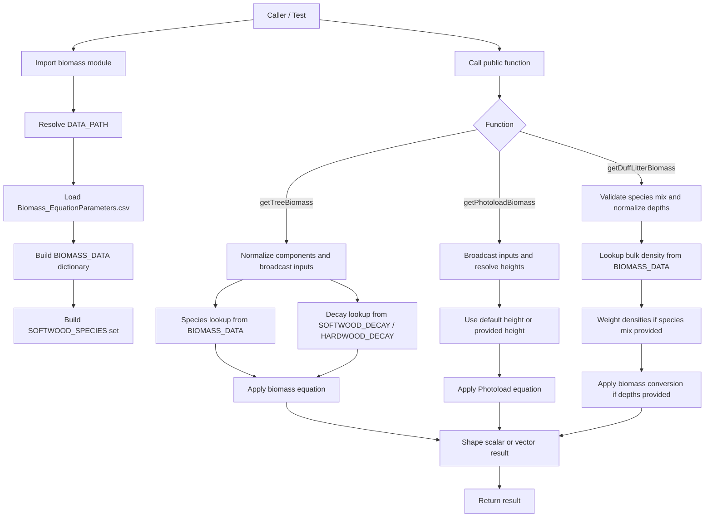

# Codebase Reference

## Architecture Overview

This repository is a small Python library for biomass calculations.

The codebase is centered on a single runtime module, `src/biomass.py`, which:

- loads species and coefficient data from a CSV file at import time
- stores that data in module-level in-memory structures
- exposes three public calculation functions
- supports both scalar inputs and vector/array-like inputs

The project does not currently include:

- an API server
- a CLI application
- background jobs
- persistence beyond the bundled CSV data file

The runtime shape is therefore:

1. Python imports `biomass`
2. `biomass.py` loads `src/supplementary_data/Biomass_EquationParameters.csv`
3. module-level lookup structures are created
4. callers invoke one of the public calculation functions
5. inputs are validated, normalized, calculated, and returned

## Key Files

### Runtime

- `src/biomass.py`
  - Main implementation module
  - Defines constants, lookup tables, private helpers, and the full public API
  - Loads the CSV dataset relative to its own file location

- `src/supplementary_data/Biomass_EquationParameters.csv`
  - Canonical input dataset for species metadata and biomass coefficients
  - Used for tree biomass coefficients and duff/litter bulk density values

- `src/__init__.py`
  - Minimal package marker
  - Re-exports the `biomass` module

### Tests

- `tests/test_biomass.py`
  - `unittest` suite for the public API
  - Adds `src/` to `sys.path` and imports `biomass` directly
  - Covers scalar and vector behavior for:
    - `getTreeBiomass`
    - `getPhotoloadBiomass`
    - `getDuffLitterBiomass`

## Public API

The current public surface is defined in `src/biomass.py`:

- `getDuffLitterBiomass(...)`
  - Returns duff/litter bulk density or biomass
  - Supports single-species and weighted species-mix calculations

- `getPhotoloadBiomass(...)`
  - Returns biomass estimates for Photoload-coded plants
  - Supports scalar and vector inputs

- `getTreeBiomass(...)`
  - Returns biomass estimates for tree components
  - Supports scalar and vector inputs

## Internal Structure

The internal code organization in `src/biomass.py` follows this pattern:

1. module constants and lookup dictionaries
2. private helpers
3. module-level data loading
4. public API functions

Notable helper roles:

- `_load_biomass_data`
  - Reads the CSV and converts numeric fields to floats

- `_broadcast_arguments`
  - Normalizes scalar and vector inputs into a single calculation path

- `_as_scalar_or_vector`
  - Converts normalized results back to a scalar or vector-shaped return

- `_normalize_components`, `_normalize_depth`, `_validate_species_mix`
  - Input validation and normalization helpers

- `_get_species_row`, `_get_decay_vector`, `_get_bulk_density`
  - Lookup and derived-value helpers

- `_resolve_photoload_height`, `_calculate_photoload_biomass`
  - Photoload-specific helper path

## Data Flow

## Implicit Assumptions and Gotchas

These are structural assumptions the current code relies on.

### Import-time data loading

`src/biomass.py` loads its CSV immediately when imported. Any caller importing the module assumes:

- the CSV exists
- the relative path from `biomass.py` is correct
- the CSV schema matches what `_load_biomass_data` expects

This means import is not just declaration time; it performs file I/O and data parsing.

### CSV schema is part of the API contract

The implementation assumes the CSV contains:

- `Species`
- `TreeType`
- duff/litter fields such as `DUFF_BD` and `LITTER_BD`
- multiple biomass coefficient columns with exact names

Column naming is tightly coupled to the code, especially for tree component equation lookup.

### `src/` layout is handled by test path injection

The current tests do not import via an installed package. Instead, `tests/test_biomass.py` prepends `src/` to `sys.path` and imports `biomass` directly.

That means the current repo layout assumes either:

- callers manipulate `PYTHONPATH` / `sys.path`, or
- the project is executed from an environment that already knows about `src/`

### Vector support is sequence-based, not NumPy-based

Vectorized behavior is implemented through Python sequences and broadcasting helpers, not through NumPy arrays or pandas objects.

The code treats non-string sequences as vector inputs and normalizes them into lists before calculation.

### Return shape depends on input shape

The public functions return different shapes based on the inputs:

- scalar inputs return scalar-like values
- vector inputs return lists
- some multi-component calculations return tuples inside those lists

Consumers need to know the expected shape based on how they call the API.

### Warning-based behavior for invalid Photoload species

Photoload invalid-species handling differs from most other validation paths:

- tree and duff/litter validation primarily raise exceptions
- Photoload invalid species emits a warning and returns `0.0`

That is an intentional behavioral distinction in the current code.

### Domain constants live in code

Several domain rules are hard-coded in `src/biomass.py`, including:

- tree component names
- softwood and hardwood decay tables
- default Photoload heights

These are treated as code-level constants, not external configuration.

## Testing Conventions

The current test suite uses the standard library `unittest` framework and groups tests by public function:

- `GetTreeBiomassTests`
- `GetPhotoloadBiomassTests`
- `GetDuffLitterBiomassTests`

Tests are written as API-level behavioral checks rather than low-level helper tests.

## Current Mental Model

The simplest way to think about this repo:

- one module
- one CSV dataset
- three public calculation functions
- a small helper layer for validation, broadcasting, and lookup
- one test module validating the public interface
